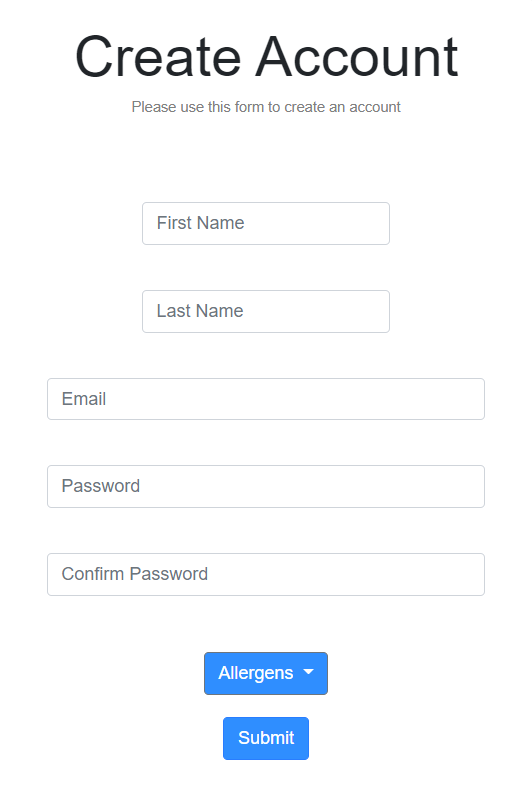

# Team Theta
## Food Match
## Fall 2022
 

# Overview
With this application, our goal was to create a website that allowed users to find restaurants with menu items that catered to their dietary restrictions. That is, if a user has dietary restrictions such as vegetarianism, veganism, or a gluten intolerance, they can use our website to find restaurants with food items that match their needs. Not only that, but the user can also select different restaurants to view their menu items filtered by their dietary preferences. Our website knows about these preferences because the user has to input them when they sign up to have an account on our website. Our website currently supports restaurants in the Amherst area and a few other nearby cities.

# Team Members

Lenin Perdomo github: perdomolenin

Dante Cortez  github: dantecor

Rohit Sonawane github: rsonawane2002

# User Interface

 This API element is used by users to sign in with the accounst they created or to create a new account.    

 This API element is used for the user to create their account with their allergen information.    

  This is used for users to find restaurants near their location.    

 This is used for users to find restaurants near their location.    

 This is what the menu the user sees once they click on a restaurant.    

  

# APIs
POST users: Gets and retrieves user information from the database  
GET restaurants: Gets restaurant information from the database.  
GET menus: Gets menu information based on the restaurant and user preferences selected.  

# Database
Because we could not find a pre-existing free database that had the restaurant information we needed, we had to create our own database using PostgreSQL. We then queried and updated this database using the Node.js endpoints that we created. The database has three tables: Menus, Restaurants, and Users. The Restaurants table contains information about the restaurants we included such as contact information, addresses, phone numbers, etc… The menus table contains menu items for each restaurant as well as the dietary restrictions that are covered by that food item. The menus table is linked to the restaurants table through the address and restaurant names (foreign keys). Finally, we made a users table with information from all the users that signed up. This table has email addresses, names, encrypted passwords, and dietary preferences. Users are linked to menu items that match their dietary preferences. Here are the SQL statements we used:    

# URL Routes Mappings
/signup: Posts a user into the Postgres database and make sure to check for repeats  
/email: Gets a list of all the emails from the Postgres database to check for repeats  
/RestaurantMenu/:RestaurantName: Gets the menu information filtered on the restaurant selected and the user preferences.  
/menus/restaurant/:restaurantName: Gets a list of restaurants available in the database.
/checkLoggedIn: Checks if the user is logged in.
/login: Logs the user in if the login information has no errors.
/home: Takes the user to the homepage.
/main: Takes teh user to the mainscreen.

# Authentication/Authorization
When they create an account, individual users are identified in our website with the email and password. The passwords are encrypted using salts and hashes (not stored as plain text). Users can only login with their email using the password they set up when they created their account. The UI element that handles this is the sign in/sign up screen the user sees in the homepage of our website.

# Division of Labor
Lenin Perdomo: Created SQL database tables and got all of information in the entries. Also programmed HTML and CSS for the mainscreen and designed the site logo.

Rohit Sonawane: Created endpoints for the user registration. Programmed CSS, HTML, and Javascript for these pages.

Dante Cortez: Programmed the password authentication and encryption. Programmed endpoints for restaurants and menu information. Programmed the CSS, HTML, and Javascript for these pages.

# Conclusion
With this project, our team learned real-life applications of the fundamentals of front-end and back-end programming. For the front-end, our team had to learn how to use Bootsrap CSS to design the website. We also got more experience modifying HTML elements using JavaScript. As for the back-end, the team learned how to use PostgreSQL to create the entire database from scratch. The time consuming nature of designing the database and manually inputting all of its values was certainly a challenge, but ultimately one that paid off and let us learn much about back-end programming. We also had to learn how to use encryption for password authentication which was a certainly not easy to learn. Finally, we learned how to create and use endpoints with Node.js to query and modify the database. As for anything we would like to have done differently, we wish we could have had more practical experience with encryption and PostgreSQL before starting the project. Nevertheless, we are glad to have learned these technologies for the project.

# Website Link (Heroku)
https://cs326-theta.herokuapp.com/home