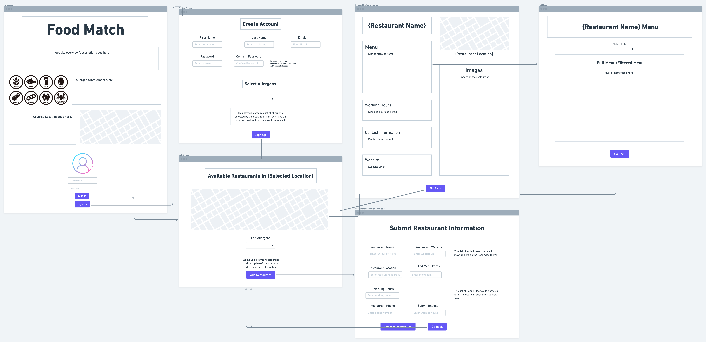
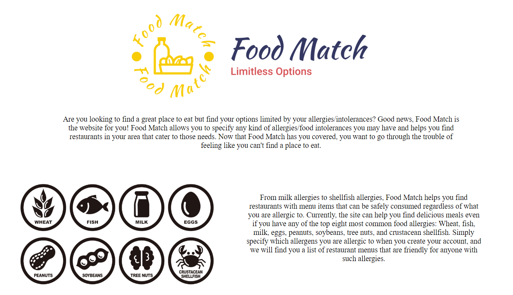
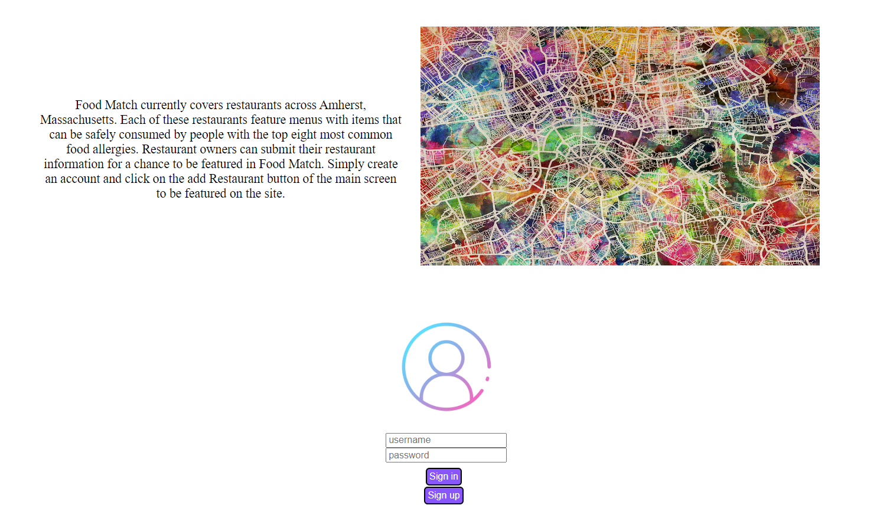
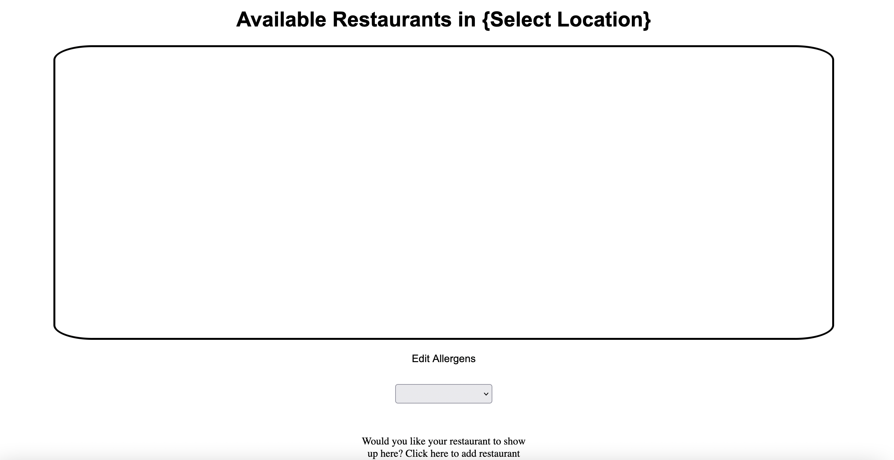
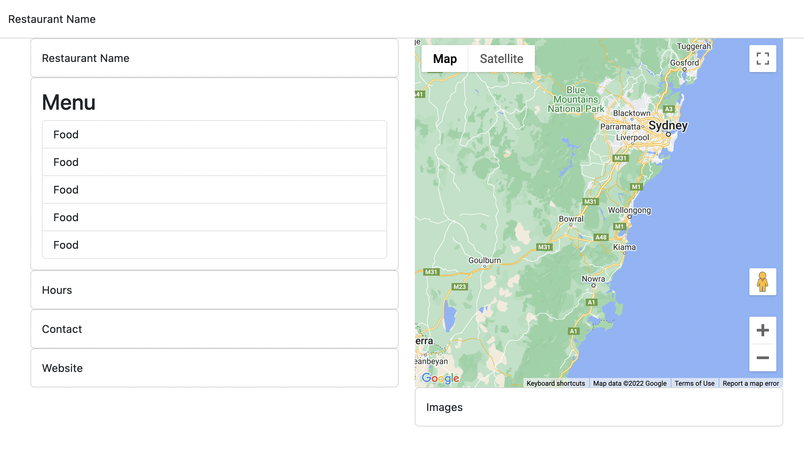
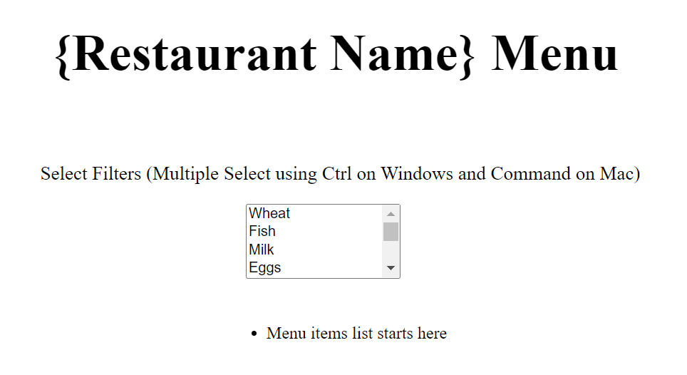
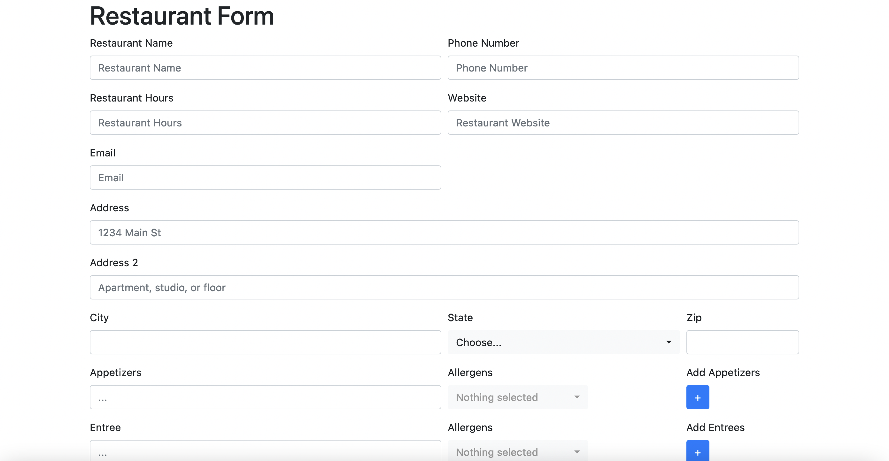

# Team Theta Milestone 1

# Application Name: Food Match

# Team Overview

Lenin Perdomo github: perdomolenin

Dante Cortez  github: dantecor

Rohit Sonawane github: rsonawane2002

# Innovative Idea

Our Application, Food Match will allow people with allergies or intolerances to certain foods to find restaurants that will cater to their needs. The application will allow users to find restaurants based on whether they can cater to dietary needs. Users will be able to then view the menu for restaurants that can cater to their specific needs and filter menu items based on the allergen specified. As far as our team knows, this application may have unique elements, but it would most likely be compared to an application like yelp. As of now, functionality will be limited to at least 10 restaurants in the surrounding area around UMass Amherst.

# Important Components

An important component will be to display restaurant data. For that, our team will manually source data on allergens from restaurants in the area around UMass Amherst. Our website will allow users to log in and save restaurants that they like. They would also be able to leave reviews for restaurants they have visited. The application will have to communicate with a backend service for persistent data storage.
We will be using the Google Maps api to display the location of the restaurants. 

We would like to make it easier for restaurants to sign up for our service and upload their own menus. This would allow the application to scale.

Allow users to log in, so that they can save restaurants and leave reviews, work in progress. Restaurant owners would need to signup so that they can be verified and submit their restaurant and menu to the web application. 

Main screen would allow users to see the restaurants in the area that support the web application

This is the page that the user would see after selecting a restaurant on the main page. It would show the name of the restaurant, and other relavant information, clicking on the menu would bring up a dedicated menu page.

The menu page would allow you to filter the menu by allergens.

The restaurant form would allow restaurants with verified accounts to submit their own restaurant and menus. 

# Contributions

Lenin Perdomo - Wireframe, Restaurant Menu Page, Homepage/Log In

Dante Cortez  github: dantecor - Wireframe, Restaurant Submission Form, Restaurant View Page

Rohit Sonawane github: rsonawane2002 -Wireframe, Main Page, Signup Page

