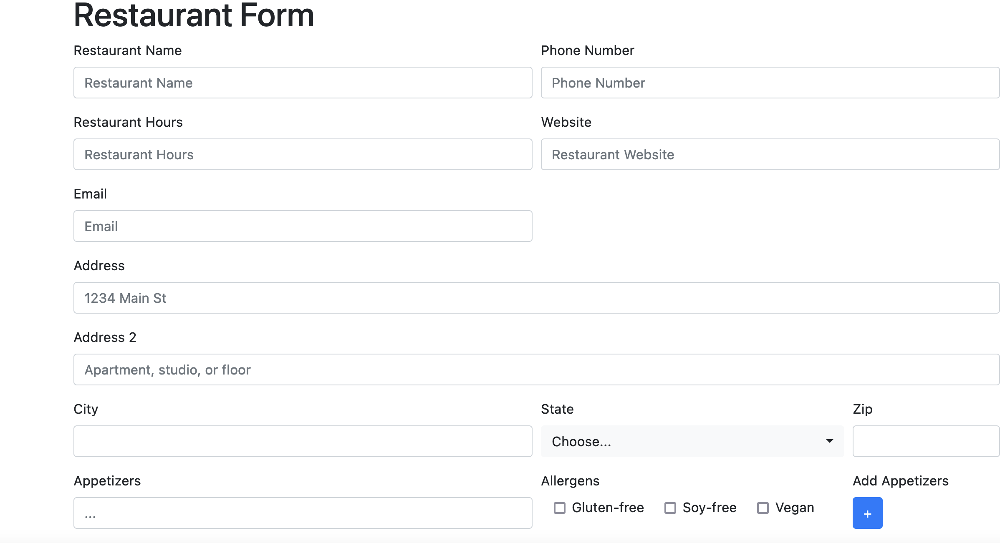
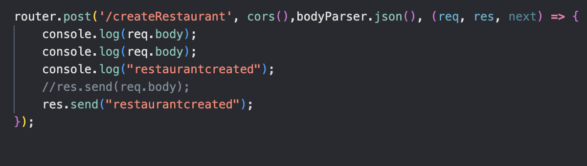
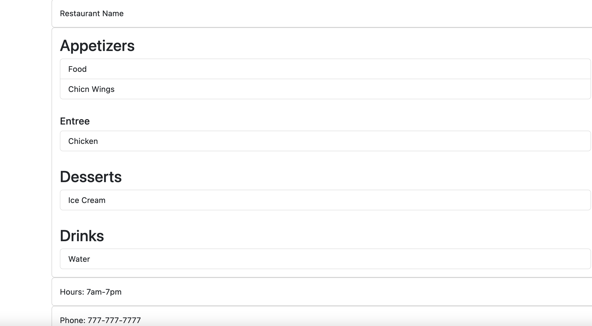
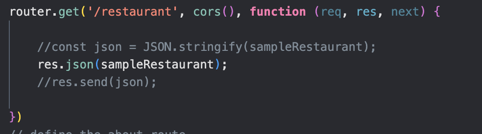
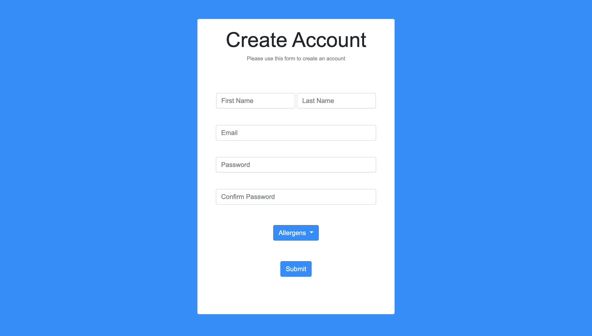
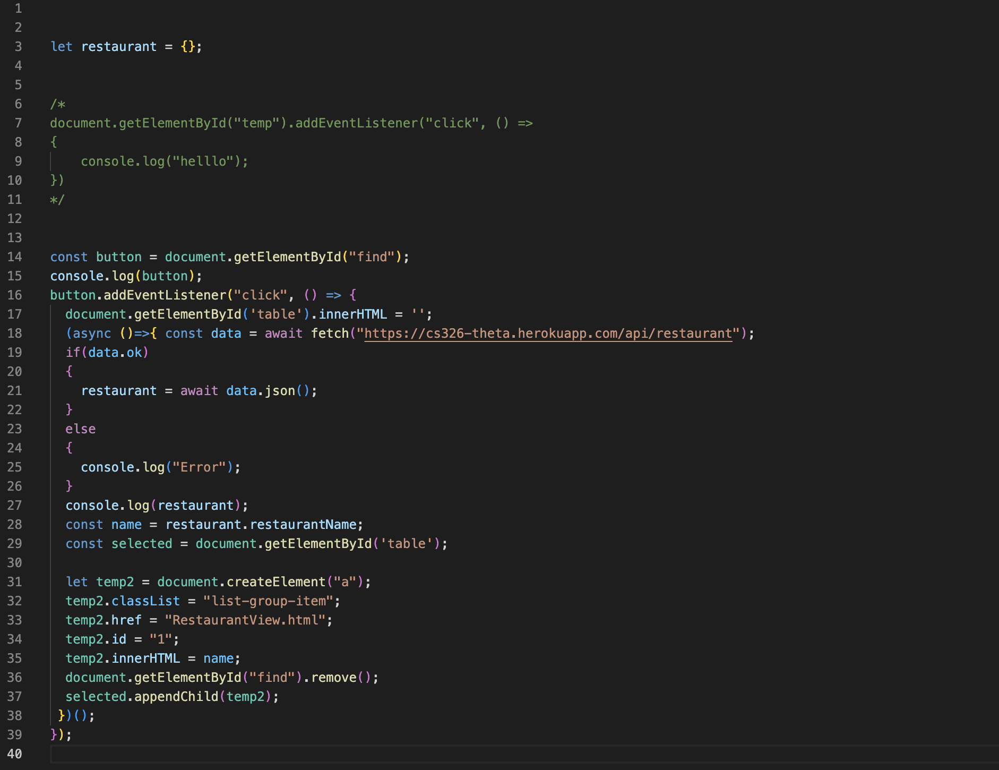
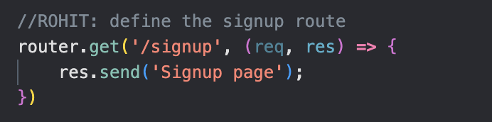

# Team Theta Milestone 2

# Application Name: Food Match

# Team Overview

Lenin Perdomo github: perdomolenin

Dante Cortez  github: dantecor

Rohit Sonawane github: rsonawane2002

# Website Link (Heroku)
https://cs326-theta.herokuapp.com/home

# Food Match API
The Food Match API can be categorized as a RESTful API. It allows users to find restaurants in Amherst, Massachusetts based on their dietary needs. Users can search for restaurants by location and filter in accordance to their menu items. The API can be used to find restaurants with vegeterian, vegan, and gluten-free meal options. Users can specify their dietary needs by registering their user information into the website's database. In addition to this, new restaurants can add items to the database such as their contact, address, and menu information.

# Concepts
The Food Match Web-API utilizes standard HTTP communication and uses REST concepts. Requests and responses contain JSON in the HTTP body. The character encoding is always UTF8.

# HTTP Requests Examples

# CRUD Operations Examples
**Create:**  

adding support to create restaurant

  

**Read:**  

Webpage will request json with menu data
 

**Update:**  
  

**Delete:**  
WIP
  

# Contributions

Lenin Perdomo github: perdomolenin - Writing API and Milestone2 Documentation, cleaning HTML for homepage and keeping website features descriptions accurate.

Dante Cortez  github: dantecor - Cleaning HTML for restaurant submission form and restaurant view page. Creating API requests for these pages.

Rohit Sonawane github: rsonawane2002 - Cleaning HTML for main page and signup page. Creating API requests for these pages.

